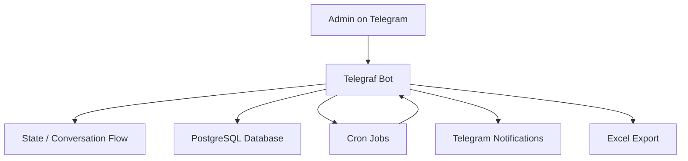
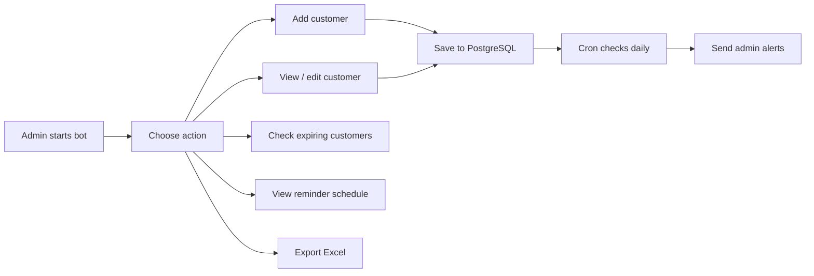

# Telegram Premium Manager Bot

A Telegram bot for managing premium customers, tracking subscription periods, scheduling renewal reminders, and exporting customer data to Excel.

## Overview

This project is designed for a single admin workflow:

- add and manage premium customers
- track start dates and expiry dates
- send daily expiry alerts
- send monthly renewal reminders
- export customer records to Excel

## Core Features

- Admin-only access using `ADMIN_ID`
- Customer CRUD inside Telegram chat
- Service-based filtering and search
- Expiry tracking with visual status indicators
- Monthly reminder scheduling
- Excel export for customer records
- PostgreSQL-backed persistence

## Architecture



## Workflow



## Tech Stack

- Node.js
- Telegraf
- PostgreSQL
- node-cron
- ExcelJS
- dotenv

## Environment Variables

Create a local `.env` file based on `.env.example`.

```env
BOT_TOKEN=your_telegram_bot_token
ADMIN_ID=your_telegram_user_id
DATABASE_URL=your_postgres_connection_string
PORT=3000
```

## Installation

```bash
npm install
```

## Run Locally

```bash
npm start
```

## Database Model

The bot stores customer records in a single `customers` table:

- `id`
- `service`
- `name`
- `note`
- `start_date`
- `expiry_date`
- `monthly_remind`

## Security Notes

- Do not commit `.env` files or deployment secrets.
- Restrict bot usage by keeping `ADMIN_ID` private and correct.
- Use a secure PostgreSQL connection in production.
- Avoid publishing real customer data, exports, or screenshots containing personal information.

## Intellectual Property

This repository is public for reference and portfolio purposes. Source code, workflow ideas, and implementation details remain associated with the author unless explicitly licensed otherwise.

If you want stronger protection:

- keep the production version private
- add a custom license or an `All Rights Reserved` notice
- keep sensitive business logic and operational data outside the public repo

## Roadmap Ideas

- multi-admin role support
- service configuration from database instead of hardcoded values
- audit log for edits and deletions
- safer export file handling
- deployment guide for Render / Railway / VPS
