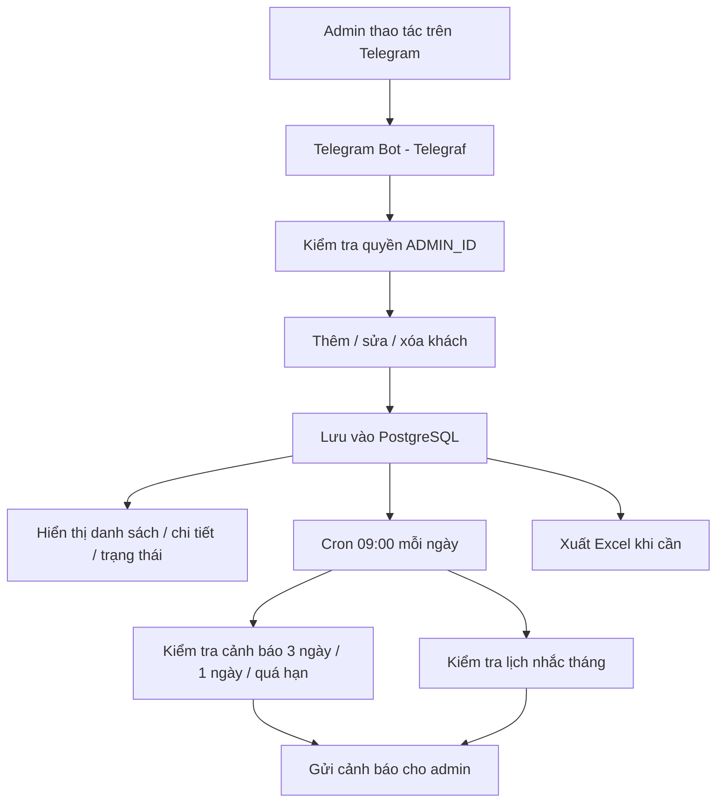

# Telegram Premium Manager Bot

Bot Telegram dành cho **1 admin** để quản lý khách hàng premium như **ChatGPT Plus, YouTube, GPT Business**. Bot tập trung vào thao tác nhanh trong Telegram: thêm khách, sửa thông tin, theo dõi hạn, nhắc xử lý và xuất Excel.

## Công nghệ sử dụng

- **Node.js**
- **Telegraf**
- **PostgreSQL**
- **node-cron**
- **ExcelJS**

## Tính năng hiện có

### 1. Quản lý khách hàng trong Telegram
- Thêm khách theo dịch vụ
- Lưu tên, ghi chú, ngày bắt đầu, ngày hết hạn
- Có thể bật / tắt nhắc gia hạn hàng tháng
- Xem danh sách và chi tiết khách ngay trong bot

### 2. Tìm kiếm và lọc nhanh
- Tìm theo tên hoặc ghi chú
- Lọc theo dịch vụ
- Hỗ trợ alias nhanh: `yt`, `gpt`, `gptb`, `biz`, `all`
- Hiển thị trạng thái hạn bằng icon trực quan

### 3. Chỉnh sửa khách hàng
- Sửa tên
- Sửa ghi chú
- Sửa ngày bắt đầu
- Sửa ngày hết hạn
- Đổi dịch vụ
- Bật / tắt nhắc tháng
- Xóa khách

#### Sửa ngày hết hạn
Khi bấm **Sửa hạn**, admin có thể nhập theo 1 trong 2 cách:
- `dd/mm/yyyy` để đặt ngày hết hạn cụ thể
- số ngày, ví dụ `30`, để đặt hạn = **hôm nay + 30 ngày**

### 4. Cảnh báo hạn cần xử lý
Bot có màn hình **⚠️ Sắp hết hạn** và cron báo tự động lúc **09:00** mỗi ngày theo múi giờ **Asia/Ho_Chi_Minh**.

Cảnh báo hiện chỉ tập trung vào các mốc cần xử lý:
- **Còn 3 ngày**
- **Còn 1 ngày**
- **Trễ hạn / quá hạn**

Các cảnh báo được gom theo từng nhóm để admin xử lý nhanh.

### 5. Nhắc gia hạn hàng tháng
- Có thể bật khi tạo khách hoặc bật lại trong màn hình chi tiết
- Bot nhắc lúc **09:00** sáng
- Ngày nhắc lấy theo ngày bắt đầu đăng ký của khách

### 6. Xóa khách thuận tiện hơn
- Có nút **🗑 Xóa** trong màn hình chi tiết
- Có thêm nút **🗑** ngay trong danh sách khách để xóa nhanh hơn

### 7. Xuất Excel
- Xuất toàn bộ dữ liệu khách hàng ra file Excel
- Bao gồm: dịch vụ, tên, ghi chú, ngày bắt đầu, ngày hết hạn, số ngày còn lại, trạng thái nhắc tháng

### 8. Phân quyền admin
- Bot chỉ xử lý thao tác từ `ADMIN_ID`
- Phù hợp cho mô hình vận hành nội bộ một người quản lý

## Flow hoạt động



## Database

Bot dùng **PostgreSQL**. Khi khởi động, ứng dụng sẽ tự tạo bảng nếu chưa tồn tại và tự chạy migration cơ bản cho dữ liệu cũ.

### Bảng `customers`

| Cột | Kiểu dữ liệu | Mô tả |
|---|---|---|
| `id` | `SERIAL PRIMARY KEY` | ID khách hàng |
| `service` | `TEXT` | Tên dịch vụ |
| `name` | `TEXT` | Tên khách hàng |
| `note` | `TEXT` | Ghi chú thêm |
| `start_date` | `TIMESTAMP` | Ngày bắt đầu |
| `expiry_date` | `TIMESTAMP` | Ngày hết hạn |
| `monthly_remind` | `BOOLEAN` | Bật / tắt nhắc hàng tháng |

## Cấu trúc repo

```bash
.
├── bot.js        # Logic bot, menu, CRUD, cron job, export Excel
├── package.json  # Khai báo dependency và script chạy
├── README.md     # Tài liệu dự án
└── LICENSE
```

## Biến môi trường

Tạo file `.env`:

```env
BOT_TOKEN=your_telegram_bot_token
ADMIN_ID=your_telegram_user_id
DATABASE_URL=your_postgresql_connection_string
PORT=3000
```

## Cài đặt và chạy

```bash
npm install
npm start
```

## Ghi chú triển khai

- Bot chạy bằng polling qua Telegraf
- Có HTTP server đơn giản để giữ process hoạt động trên một số nền tảng deploy
- Cron dùng múi giờ `Asia/Ho_Chi_Minh`
- Nên dùng PostgreSQL có SSL khi deploy production

## Phù hợp với ai?

Repo này phù hợp cho các nhu cầu như:
- quản lý khách hàng gia hạn thủ công
- bot vận hành nội bộ cho dịch vụ subscription
- hệ thống nhắc hạn đơn giản, nhẹ, dễ deploy

## Liên hệ
- Zalo: 08989 08101
