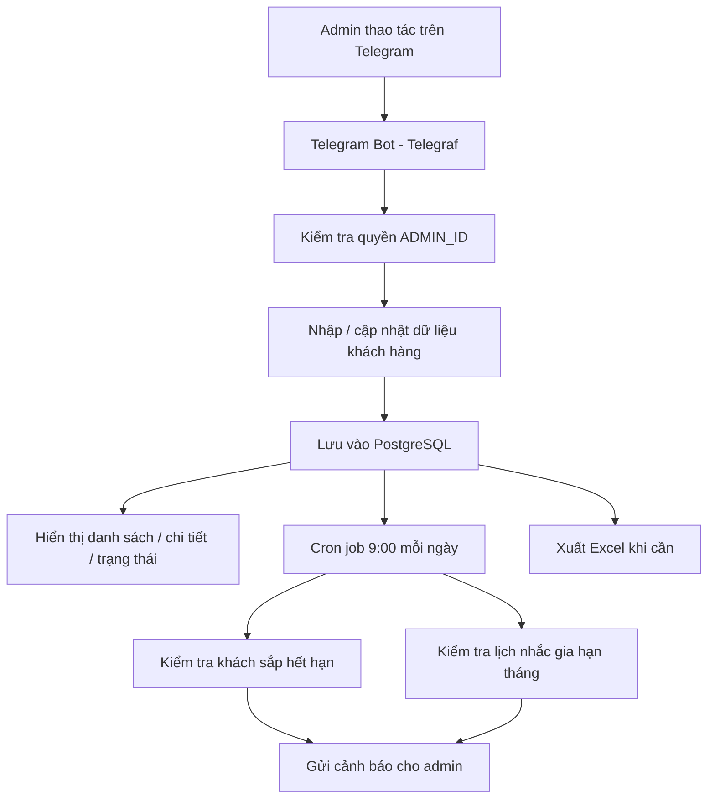
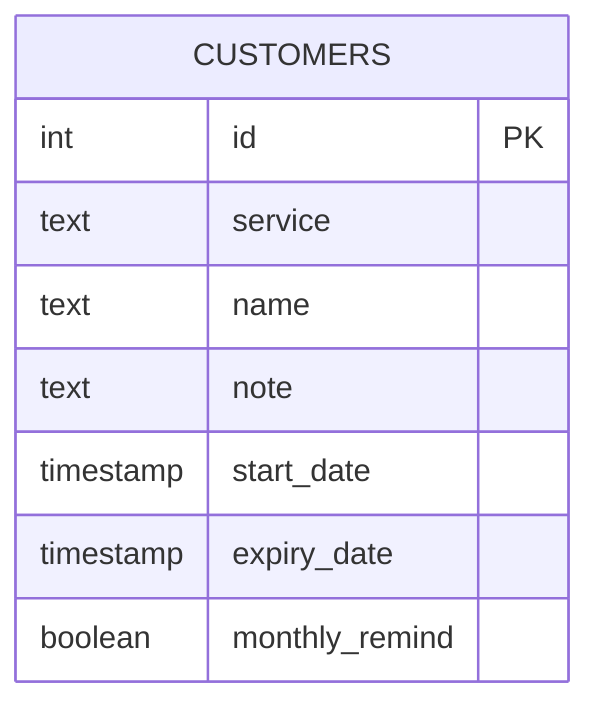

# Telegram Premium Manager Bot

Bot Telegram dành cho **1 admin** để quản lý khách hàng sử dụng các gói premium như **ChatGPT Plus, YouTube, GPT Business**. Repo này tập trung vào một quy trình vận hành đơn giản: lưu thông tin khách hàng, theo dõi thời hạn sử dụng, nhắc gia hạn định kỳ và xuất dữ liệu để quản lý nhanh.

## Repo này có gì?

Đây là mã nguồn hoàn chỉnh cho một bot quản lý khách hàng premium chạy trên:

- **Node.js**
- **Telegraf**
- **PostgreSQL**
- **node-cron**
- **ExcelJS**

Project phù hợp cho các case:

- quản lý danh sách khách hàng theo dịch vụ
- theo dõi ngày bắt đầu và ngày hết hạn
- nhận cảnh báo khách sắp hết hạn
- nhắc gia hạn hàng tháng theo ngày đăng ký
- xuất danh sách khách hàng ra file Excel

## Tính năng chính

### 1. Quản lý khách hàng ngay trong Telegram
- Thêm khách mới theo từng dịch vụ
- Lưu tên, ghi chú, ngày bắt đầu, số tháng sử dụng
- Tự động tính ngày hết hạn
- Xem danh sách khách hàng trực tiếp trong bot

### 2. Tìm kiếm và lọc dữ liệu nhanh
- Lọc theo dịch vụ
- Tìm theo tên hoặc ghi chú
- Hiển thị trạng thái còn hạn / sắp hết hạn / quá hạn bằng icon trực quan

### 3. Chỉnh sửa và cập nhật linh hoạt
- Sửa tên
- Sửa ghi chú
- Sửa ngày bắt đầu
- Sửa ngày hết hạn
- Đổi dịch vụ
- Bật / tắt nhắc gia hạn hàng tháng
- Xóa từng khách hàng

### 4. Cảnh báo sắp hết hạn
Bot tự động kiểm tra dữ liệu và gửi thông báo cho admin với các khách hàng:
- sắp hết hạn trong 7 ngày
- đã quá hạn
- ưu tiên các mốc cần chú ý như 7 ngày, 3 ngày, 2 ngày, 1 ngày, hôm nay, trễ 1–2 ngày

### 5. Nhắc gia hạn hàng tháng
- Có thể bật nhắc định kỳ khi tạo khách hàng
- Bot gửi nhắc vào **9:00 sáng** theo múi giờ **Asia/Ho_Chi_Minh**
- Ngày nhắc được lấy theo ngày bắt đầu đăng ký của khách

### 6. Xuất file Excel
- Xuất toàn bộ dữ liệu khách hàng ra Excel
- Bao gồm dịch vụ, tên, ghi chú, ngày bắt đầu, ngày hết hạn, số ngày còn lại và trạng thái nhắc tháng

### 7. Phân quyền admin
- Bot chỉ xử lý lệnh từ `ADMIN_ID`
- Phù hợp cho mô hình quản lý nội bộ, 1 người vận hành

## Flow hoạt động



## Database

Bot sử dụng **PostgreSQL** để lưu dữ liệu khách hàng. Khi khởi động, ứng dụng sẽ tự tạo bảng nếu chưa tồn tại và tự chạy một số lệnh migration cơ bản.

### Bảng `customers`

| Cột | Kiểu dữ liệu | Mô tả |
|---|---|---|
| `id` | `SERIAL PRIMARY KEY` | ID khách hàng |
| `service` | `TEXT` | Tên dịch vụ |
| `name` | `TEXT` | Tên khách hàng |
| `note` | `TEXT` | Ghi chú thêm |
| `start_date` | `TIMESTAMP` | Ngày bắt đầu |
| `expiry_date` | `TIMESTAMP` | Ngày hết hạn |
| `monthly_remind` | `BOOLEAN` | Bật/tắt nhắc hàng tháng |

### Sơ đồ dữ liệu



## Cấu trúc repo

```bash
.
├── bot.js        # Logic bot, menu, CRUD, cron job, export Excel
├── package.json  # Khai báo dependency và script chạy
├── README.md     # Tài liệu dự án
└── LICENSE
```

## Biến môi trường

Tạo file `.env`:

```env
BOT_TOKEN=your_telegram_bot_token
ADMIN_ID=your_telegram_user_id
DATABASE_URL=your_postgresql_connection_string
PORT=3000
```

## Cài đặt và chạy

```bash
npm install
npm start
```

## Ghi chú triển khai

- Bot chạy bằng polling qua Telegraf
- Có HTTP server đơn giản để giữ process hoạt động trên một số nền tảng deploy
- Cron job dùng múi giờ `Asia/Ho_Chi_Minh`
- Nên dùng PostgreSQL có SSL khi deploy production

## Phù hợp với ai?

Repo này phù hợp để tham khảo hoặc phát triển tiếp cho các nhu cầu:
- quản lý khách hàng gia hạn thủ công
- bot vận hành nội bộ cho dịch vụ subscription
- hệ thống nhắc hạn đơn giản, nhẹ, dễ deploy

## Định hướng mở rộng

- hỗ trợ nhiều admin
- thêm phân loại dịch vụ động từ database
- thêm lịch sử chỉnh sửa
- thêm thống kê doanh thu hoặc số lượng khách theo dịch vụ
- tách code thành nhiều module để dễ bảo trì hơn
